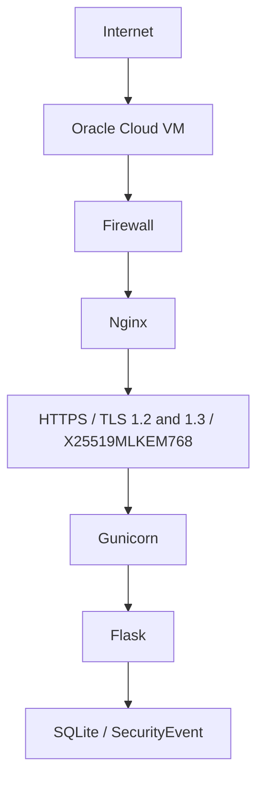
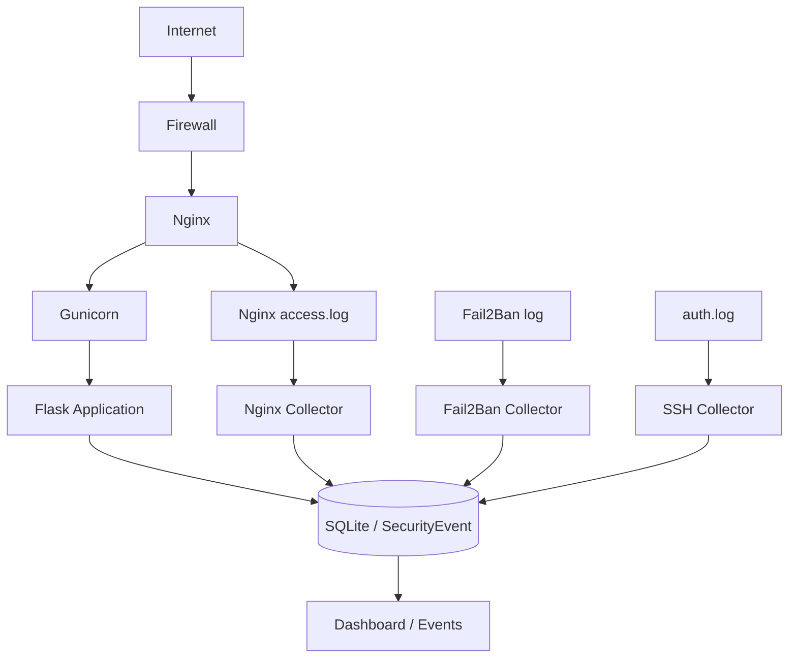

# SecureOps

## Overview

SecureOps is a Flask-based security monitoring and DevSecOps project developed for academic practice in Application Security, Cloud Infrastructure and Computer Security.

The project evolved from a protected web application into a small Security Monitoring Console with SIEM/SOC-inspired visibility. It combines secure authentication, security event logging, infrastructure hardening, HTTPS, post-quantum TLS key exchange and automated CI/CD deployment.

Production URL:

**https://secureops.leonardooliveira.dev**

Current version:

**SecureOps v1.1.0**

## Objectives

SecureOps demonstrates how application security, infrastructure hardening and DevSecOps practices can be combined in a small but functional monitoring platform.

The project focuses on:

- secure authentication and protected routes;
- security event monitoring with severity and source IP;
- infrastructure telemetry from Nginx, Fail2Ban and SSH logs;
- OWASP Top 10:2025 related controls;
- cloud deployment on Oracle Cloud;
- HTTPS, TLS hardening and post-quantum key exchange;
- automated testing, security analysis and deployment validation.

## Features

Application features:

- login and logout;
- logout via POST;
- session-based authentication;
- protected dashboard;
- protected security events page;
- public `/health` endpoint;
- real client IP support behind Nginx through `ProxyFix`;
- centralized application version through `APP_VERSION`.

Dashboard features:

- Events Last 24h;
- High / Critical;
- Authentication Failures;
- Access Denied;
- Unique Source IPs;
- Rate Limit Hits;
- Events Over Time;
- Severity Distribution;
- Event Types;
- Top Source IPs;
- Recent Security Events;
- Security Posture;
- Active Security Controls.

Security Events page:

- event listing;
- search;
- severity filters;
- event type filters;
- pagination;
- severity badges.

Recorded event types:

- `AUTH_SUCCESS`
- `AUTH_FAILURE`
- `LOGOUT`
- `UNAUTHORIZED_ACCESS`
- `RATE_LIMIT_EXCEEDED`
- `NGINX_403`
- `NGINX_404`
- `SUSPICIOUS_PATH`
- `IP_BANNED`
- `IP_UNBANNED`
- `SSH_AUTH_FAILURE`
- `SSH_INVALID_USER`

Supported severities:

- `INFO`
- `LOW`
- `MEDIUM`
- `HIGH`
- `CRITICAL`

## Architecture

Production architecture:



Infrastructure telemetry architecture:



Trust boundaries:

- Nginx is the single trusted reverse proxy in front of Flask.
- Flask/Gunicorn does not read infrastructure logs.
- Collectors run outside the web request path.
- Collectors write minimized telemetry into `SecurityEvent`.
- Gunicorn listens behind Nginx and does not require extra log-reading privileges.

## Technology Stack

- Python
- Flask
- Jinja
- Flask-SQLAlchemy
- SQLite
- Flask-WTF / CSRF
- Flask-Limiter
- Gunicorn
- Nginx
- Oracle Cloud VM
- Ubuntu Server 24.04
- GitHub Actions
- Bandit
- pip-audit
- pytest

## Security Controls

Application controls:

- session-based authentication;
- password hashing;
- generic authentication errors;
- CSRF protection;
- logout via POST;
- rate limiting;
- `Secure` cookies in production;
- `HttpOnly` cookies;
- `SameSite=Lax`;
- Content Security Policy;
- `X-Frame-Options`;
- `X-Content-Type-Options`;
- `Referrer-Policy`;
- HSTS in production HTTPS;
- `ProxyFix` configured for one trusted reverse proxy;
- SQLAlchemy ORM and parameterized queries;
- Jinja autoescaping;
- mandatory `SECRET_KEY` validation in production.

Infrastructure controls:

- Oracle Cloud deployment;
- Ubuntu Server 24.04;
- SSH key-based access;
- `PasswordAuthentication` disabled;
- least-privilege firewall exposure;
- Fail2Ban enabled with `sshd` jail;
- Fail2Ban `maxretry = 4`;
- Fail2Ban `findtime = 10 minutes`;
- Fail2Ban `bantime = 24 hours`;
- Nginx as reverse proxy;
- Certbot 5.7.0;
- Let's Encrypt certificate;
- automatic certificate renewal.

## Infrastructure Security Telemetry

SecureOps uses three independent collectors. They are not part of the Flask request lifecycle.

Common collector properties:

- independent from Flask/Gunicorn;
- one-shot execution;
- checkpoint based on inode and offset;
- rotation and truncation handling;
- `--dry-run` support;
- periodic production execution through systemd timers;
- no `sudo` or subprocess execution inside Python;
- no additional log-reading privileges for Gunicorn.

Production timers are configured on the VM and are not provisioned by this repository:

- `secureops-nginx-collector.timer`
- `secureops-fail2ban-collector.timer`
- `secureops-ssh-collector.timer`

They run approximately once per minute in production.

### Nginx

Source:

```text
/var/log/nginx-pqc/access.log
```

Collector:

```bash
python scripts/nginx_collector.py
```

Events:

- `NGINX_403` with `MEDIUM` severity;
- `NGINX_404` with `LOW` severity;
- `SUSPICIOUS_PATH` with `HIGH` severity.

The Nginx collector supports Combined Log Format, ignores normal traffic and assets, strips query strings from descriptions and stores only minimized path-based telemetry.

Dry-run:

```bash
python scripts/nginx_collector.py --dry-run
```

### Fail2Ban

Source:

```text
/var/log/fail2ban.log
```

Collector:

```bash
python scripts/fail2ban_collector.py
```

Events:

- `IP_BANNED` with `HIGH` severity;
- `IP_UNBANNED` with `INFO` severity.

The Fail2Ban collector supports IPv4 and IPv6, accepts any jail name and stores only the source IP, action and jail name in a short description.

Dry-run:

```bash
python scripts/fail2ban_collector.py --dry-run
```

### SSH

Source:

```text
/var/log/auth.log
```

Collector:

```bash
python scripts/ssh_collector.py
```

Events:

- `SSH_AUTH_FAILURE` with `MEDIUM` severity;
- `SSH_INVALID_USER` with `HIGH` severity.

The SSH collector supports IPv4 and IPv6, traditional syslog timestamps and ISO 8601 timestamps used by Ubuntu 24.04. It does not store username, port, PID, hostname, fingerprint, public key or the full log line. `SecurityEvent.created_at` represents ingestion time.

Dry-run:

```bash
python scripts/ssh_collector.py --dry-run
```

## OWASP Top 10:2025

SecureOps implements controls related to selected OWASP Top 10:2025 categories. It mitigates aspects of these risks; it is not a complete compliance framework.

### A01 - Broken Access Control

Related controls:

- `login_required` protection for internal routes;
- protected dashboard and events pages;
- session-based access checks;
- logout via POST;
- `UNAUTHORIZED_ACCESS` event recording;
- secure session cookie settings.

### A07 - Identification and Authentication Failures

Related controls:

- password hashing;
- generic login error messages;
- login rate limiting;
- `AUTH_FAILURE` event recording;
- `RATE_LIMIT_EXCEEDED` event recording;
- Fail2Ban protection;
- SSH key-based access;
- disabled SSH password authentication.

### A09 - Security Logging and Monitoring Failures

Related controls:

- centralized `SecurityEvent` model;
- event severity;
- source IP recording;
- dashboard visibility;
- event search, filters and pagination;
- Nginx telemetry;
- Fail2Ban telemetry;
- SSH telemetry;
- top source IPs;
- event type and severity distributions.

## HTTPS, TLS and Post-Quantum Cryptography

Production transport security:

- Nginx 1.30.4 custom build;
- OpenSSL 3.5.8;
- TLS 1.2;
- TLS 1.3;
- X25519MLKEM768;
- valid HTTPS certificate;
- HTTP to HTTPS redirect;
- HSTS;
- SSL Labs A+;
- PQC Key Exchange Supported.

## DevSecOps / CI-CD

SecureOps uses GitHub Actions for CI and CD.

CI flow:

```text
push / pull request
   |
   v
pytest
   |
   v
Bandit
   |
   v
pip-audit
```

CD flow:

```text
push to main
   |
   v
CI approved
   |
   v
Dedicated SSH connection
   |
   v
Oracle Cloud VM
   |
   v
git pull --ff-only
   |
   v
pip install
   |
   v
restart secureops
   |
   v
internal health check
   |
   v
public health check
```

GitHub Secrets used by deployment:

- `OCI_HOST`
- `OCI_USER`
- `OCI_SSH_KEY`
- `OCI_KNOWN_HOSTS`

Secret values are not stored in the repository.

## Health Check

The public health endpoint is:

```text
GET /health
```

Expected production response:

```json
{
  "application": "SecureOps",
  "environment": "production",
  "status": "healthy",
  "version": "1.1.0"
}
```

The endpoint does not expose secrets, database paths, internal addresses, admin users or full configuration.

## Running Locally

Create and activate a virtual environment, install dependencies and run the app:

```bash
python -m venv .venv
. .venv/bin/activate
pip install -r requirements.txt
python run.py
```

Use `.env.example` as a reference for local environment variables.

## Testing and Security Validation

Current known validation status:

```text
pytest: 87 passed
Bandit: No issues identified
pip-audit: No known vulnerabilities found
```

Validation commands:

```bash
python -m pytest
bandit -r app scripts
pip-audit
git diff --check
```

## Environment Variables

Core application:

- `APP_ENV`
- `SECRET_KEY`
- `DATABASE_URL`
- `SECUREOPS_ADMIN_USER`
- `SECUREOPS_ADMIN_PASSWORD`
- `RATELIMIT_STORAGE_URI`

Collectors:

- `NGINX_ACCESS_LOG`
- `NGINX_COLLECTOR_STATE`
- `FAIL2BAN_LOG`
- `FAIL2BAN_COLLECTOR_STATE`
- `SSH_AUTH_LOG`
- `SSH_COLLECTOR_STATE`

Security posture display:

- `SECURITY_TLS`
- `SECURITY_PQC`
- `SECURITY_SSL_LABS`

Do not commit real secrets, private keys, passwords or production-only credentials.

## Project Structure

```text
app/
  auth/
  collectors/
  dashboard/
  events/
  models/
  static/
  templates/
scripts/
tests/
docs/
```

Key files:

- `app/__init__.py`: application factory, security headers, health endpoint and `ProxyFix`;
- `app/models/security_event.py`: security event model;
- `app/dashboard/service.py`: dashboard aggregations;
- `app/collectors/nginx.py`: Nginx telemetry collector;
- `app/collectors/fail2ban.py`: Fail2Ban telemetry collector;
- `app/collectors/ssh.py`: SSH telemetry collector;
- `scripts/`: collector entrypoints.

## Production Deployment

Production runs on Oracle Cloud with Nginx in front of Gunicorn. Gunicorn listens behind Nginx, and Flask trusts exactly one reverse proxy through Werkzeug `ProxyFix`.

The three collectors run outside Gunicorn and write to the same `SecurityEvent` database used by the dashboard and events page.

Systemd timers are configured directly on the production VM:

- `secureops-nginx-collector.timer`
- `secureops-fail2ban-collector.timer`
- `secureops-ssh-collector.timer`

These timers are production configuration, not automatically provisioned by this repository.

## Limitations

SecureOps v1.1 is intentionally scoped as a small security monitoring console, not a replacement for a commercial SIEM.

Known limitations:

- SQLite database;
- single VM deployment;
- no event correlation engine;
- no external alerting;
- no WebSocket or real-time streaming;
- dashboard updates by page refresh;
- file-based collectors;
- no advanced retention policy;
- no clustering;
- no threat intelligence enrichment;
- no anomaly detection or machine learning.

## Future Work

Potential v1.2 improvements:

- dedicated Analytics page;
- real System Status page;
- event correlation;
- external alerts;
- PostgreSQL;
- retention policies;
- privacy-aware IP geolocation;
- threat intelligence enrichment;
- advanced grouping and deduplication;
- collector health metrics;
- anomaly detection.

## Academic Context

SecureOps was developed as an academic project for studying secure software development, infrastructure hardening, cloud deployment and DevSecOps automation.

The project demonstrates practical controls related to authentication, access control, security monitoring, TLS hardening, post-quantum key exchange, CI/CD and infrastructure telemetry.
