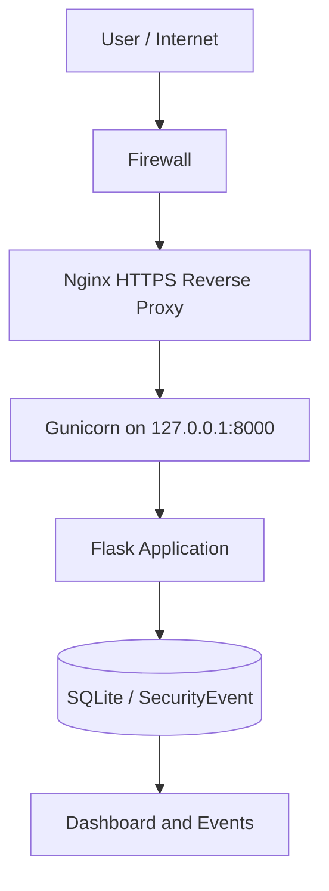
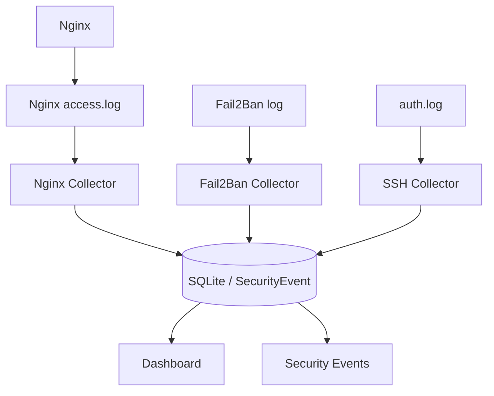
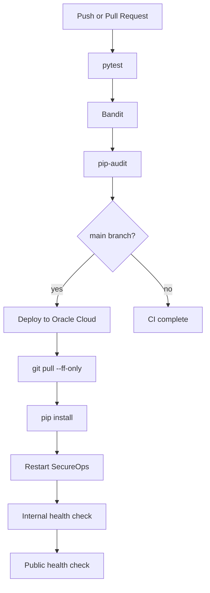

# SecureOps Architecture

## Overview

SecureOps v1.1 runs as a Flask application behind Nginx and Gunicorn on an Oracle Cloud Ubuntu Server 24.04 VM. It stores security telemetry in SQLite through the `SecurityEvent` model.

The application presents a protected SOC/SIEM-style dashboard and a protected Security Events page. Infrastructure telemetry is collected by separate one-shot collectors for Nginx, Fail2Ban and SSH.

## Runtime Flow

## Telemetry Flow

## Collector Separation

Collectors are separate from Flask and Gunicorn:

- they run as one-shot commands;
- they process only new log lines through inode and offset checkpoints;
- they support log rotation and truncation;
- they support `--dry-run`;
- they do not run inside a Flask request;
- they do not give log-reading privileges to Gunicorn;
- they do not use `sudo` or privileged shell commands from Python.

Production uses separate systemd timers for each collector. These timers are configured on the VM and are not provisioned automatically by this repository.

## Trust Boundaries

- Nginx is the trusted reverse proxy in front of Flask.
- Flask trusts one proxy through Werkzeug `ProxyFix`.
- Public traffic reaches Flask only through Nginx.
- Infrastructure logs are consumed by collectors, not by the web process.
- Collector output is minimized before becoming `SecurityEvent` data.
- GitHub Actions uses repository secrets for deployment; secret values are not stored in Git.

## CI/CD Flow

## Event Model

`SecurityEvent` stores:

- event type;
- severity;
- source IP;
- minimized description;
- creation timestamp.

The current schema intentionally avoids storing raw logs, request bodies, cookies, credentials, SSH fingerprints or full infrastructure configuration.
